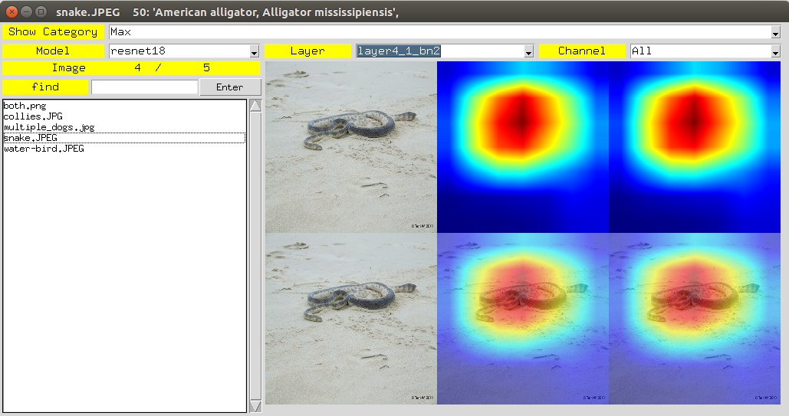

# GradcamVisGUI
Visulization GUI for gradcam and gradcam++.

The visualized image of gradcam and gradcam++ is min-max scale to 0 ~ 255, so the strength is a **relative value** for each layers and channels. 
It only reflects the information that the selected layer or channel focus on which part in the original image.

# References:

https://github.com/1Konny/gradcam_plus_plus-pytorch
https://gist.github.com/yrevar/942d3a0ac09ec9e5eb3a
https://blog.csdn.net/LegenDavid/article/details/73335578
